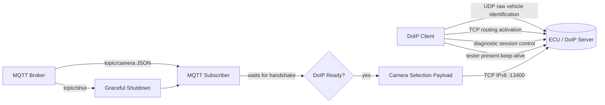
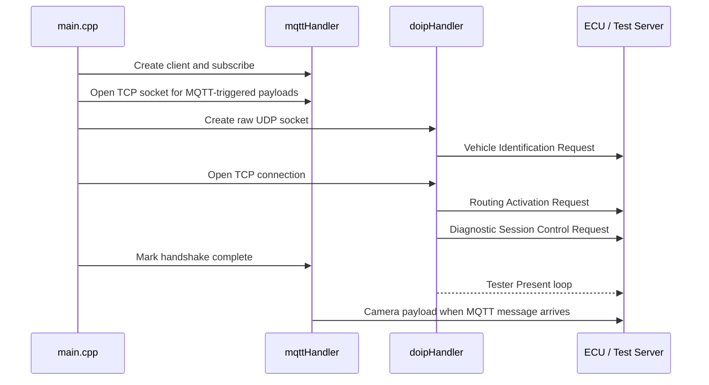
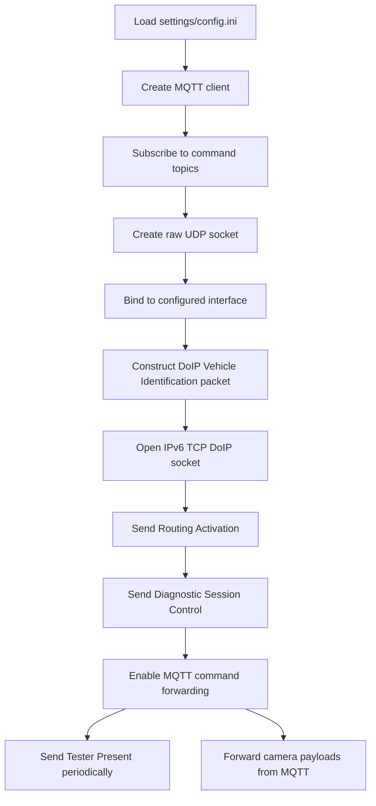

# DoIP Server Client with MQTT

<p align="center">
  <b>Bridge MQTT control messages into Diagnostics over IP camera-selection payloads.</b>
</p>

<p align="center">
  
  
  
  
</p>

---

## What This Project Does

This repository contains a C++ DoIP client that talks to an ECU or test server over IPv6 while listening for MQTT commands. Once the DoIP connection is initialized, incoming MQTT camera-selection messages are translated into diagnostic payloads and sent through the TCP DoIP channel.



## Feature Map

| Area | What is implemented |
| --- | --- |
| DoIP discovery | Builds and sends a raw Ethernet + VLAN + IPv6 + UDP Vehicle Identification request |
| DoIP TCP flow | Opens an IPv6 TCP socket and sends Routing Activation and Diagnostic Session Control requests |
| Keep alive | Runs a background Tester Present loop after the handshake |
| MQTT bridge | Uses Eclipse Paho MQTT C client to subscribe to camera and shutdown topics |
| Camera commands | Maps `Front`, `Rear`, `Left`, and `Right` camera IDs to predefined payload bytes |
| Configuration | Loads network, MQTT, packet length, and timing values from `settings/config.ini` |
| Test utility | Includes a mock IPv6 TCP server that prints received payload bytes |

## Repository Layout

```text
.
├── CMakeLists.txt
├── main.cpp
├── include/
│   ├── doip-client.h
│   ├── doip-config.h
│   └── mqtt-subscriber.h
├── src/
│   ├── doip-client.cpp
│   └── mqtt-subscriber.cpp
├── settings/
│   ├── config.cpp
│   ├── config.h
│   └── config.example.ini
└── server/
    └── mock-tcp-server-multiple-clients.cpp
```

## Runtime Sequence



## Prerequisites

This project is intended for Linux-like environments with raw socket support.

- C++17 compiler
- CMake 3.10 or newer
- pthread
- Eclipse Paho MQTT C library
- A reachable MQTT broker
- Root privileges or `CAP_NET_RAW` for raw Ethernet socket creation

The current `CMakeLists.txt` expects Paho MQTT C at:

```text
../paho.mqtt.c
```

with the shared library at:

```text
../paho.mqtt.c/build/src/libpaho-mqtt3c.so
```

## Configuration

Create your runtime config from the example:

```bash
cp settings/config.example.ini settings/config.ini
```

Then update the values for your network and MQTT broker:

```ini
[MQTT]
BROKER_IP=<broker-ip>
TOPIC=test/Topic
CAMERA_TOPIC=topic/camera
SHUT_TOPIC=topic/shut
QOS=1
CLIENT_ID=client1-authn-ID

[UDP-RAW-PACKET-NETWORK]
SRC_MAC=02:84:cf:3b:be:08
DEST_MAC=33:33:00:00:00:01
SRC_IP=fd53:7cb8:383:4::107
DEST_MULTICAST_IP=ff02::1
DEST_IP=::1
DEST_PORT=13400
INTERFACE=eth0
```

Important fields:

| Key | Purpose |
| --- | --- |
| `BROKER_IP` | MQTT broker host used as `tcp://<BROKER_IP>:1883` |
| `CAMERA_TOPIC` | Topic that carries camera-selection JSON |
| `SHUT_TOPIC` | Topic that stops the application |
| `INTERFACE` | Linux interface used for the raw UDP DoIP discovery packet |
| `SRC_MAC` / `DEST_MAC` | Ethernet addresses used in the raw frame |
| `SRC_IP` / `DEST_MULTICAST_IP` | IPv6 addresses for vehicle identification |
| `DEST_IP` / `DEST_PORT` | IPv6 TCP endpoint for DoIP traffic |
| `KEEP_ALIVE_INTERVAL` | Tester Present interval in milliseconds |

## Build

```bash
cmake -S . -B build
cmake --build build
```

Generated targets:

| Target | Description |
| --- | --- |
| `doip-client` | Main DoIP + MQTT bridge application |
| `itrams-mqtt-subscriber` | Subscriber target built from the same main flow |
| `doip-lib` | Internal library for DoIP/config code |

## Run

Because the application creates an `AF_PACKET` raw socket, run it with the privileges required by your system:

```bash
sudo ./build/doip-client
```

For a local TCP-only smoke test, compile and run the mock server in another terminal:

```bash
g++ -std=c++17 server/mock-tcp-server-multiple-clients.cpp -pthread -o mock-doip-server
./mock-doip-server
```

Then set:

```ini
DEST_IP=::1
DEST_PORT=13400
```

## MQTT Message Format

The subscriber extracts `mode` and `cameraId` from a simple JSON payload. The current camera routing depends on `cameraId`.

```json
{
  "mode": "manual",
  "cameraId": "Front"
}
```

Supported camera IDs:

| `cameraId` | Diagnostic payload |
| --- | --- |
| `Front` | Front camera selection |
| `Rear` | Rear camera selection |
| `Left` | Left camera selection |
| `Right` | Right camera selection |

Shutdown topic:

```text
topic/shut
```

Any message received on the shutdown topic closes MQTT, closes the TCP socket, wakes waiting threads, and stops the app loop.

## Packet Pipeline



## Notes And Caveats

- Raw socket support is Linux-specific; macOS will not compile this project as-is because it includes Linux networking headers such as `linux/if_packet.h`.
- The README uses `settings/config.ini` because `main.cpp` loads that exact path. The repository includes `settings/config.example.ini`, so copy it before running.
- The UDP checksum function currently has an inline code note saying it needs review. Treat packet-level validation as an active development area.
- MQTT JSON parsing is lightweight C-string scanning, so keep incoming payloads small and predictable.
- `CMakeLists.txt` currently uses a fixed relative Paho path. If your Paho checkout lives elsewhere, update `PAHO_SRC_DIR`.

## Quick Troubleshooting

| Symptom | Likely cause |
| --- | --- |
| `Udp Raw Socket creation Failed, Permission Denied.` | Run with `sudo` or grant raw socket capability |
| `Could not open the file!` | `settings/config.ini` is missing |
| MQTT connect fails | Broker IP, port `1883`, or network route is unavailable |
| TCP connect fails | `DEST_IP` / `DEST_PORT` does not point to a listening DoIP server |
| No camera command is sent | DoIP handshake has not completed, so MQTT callback is waiting |

## Project Status

This is a working prototype-style bridge for experimenting with DoIP, MQTT-triggered diagnostic requests, and camera-selection payload routing. It is especially useful for bench setups where an MQTT control plane needs to drive diagnostic traffic toward an ECU, simulator, or mock DoIP endpoint.
